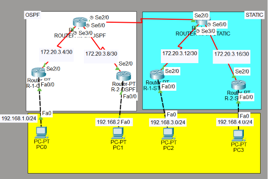

# Lab 05: Dynamic-Static Routing Basic <Badge type="warning" text="WIP"/>

## 1. Concept High-Level

> **TL;DR:** Dynamic routing enables routers to automatically learn, evaluate, and adapt network paths across interconnected networks using protocols like OSPF or BGP, ensuring efficient packet forwarding without manual static route management. Otherwise, static routing requires manual configuration of routes.

- **Role:** Layer 3 (Network Layer) Packet Routing & Path Determination
- **Standard:** Cisco IOS / RFC Standards (OSPF: RFC 2328, BGP: RFC 4271)
- **Why use it?**
  - Automatically calculates optimal network paths and adapts to topology changes (failover).
  - Eliminates manual static route management on complex and growing networks.
  - Unlike Layer 2 switches (which forward frames within a LAN using MAC addresses), routers forward IP packets across different networks using routing tables.

## 2. Lab Topology



##### OSPF Routing

- ###### Router-Core:

| Device | Interface           | IP Address                                  | Role        |
| :----- | :------------------ | :------------------------------------------ | :---------- |
| R-MAIN | se2/0, se3/0, se6/0 | 172.20.3.1/30, 172.20.3.5/30, 172.20.3.9/30 | Core Router |

- ###### AREA 1:

| Device | Interface    | IP Address                    | Role         |
| :----- | :----------- | :---------------------------- | :----------- |
| R-1    | se2/0, fa0/0 | 172.20.3.6/30, 192.168.1.1/24 | Child Router |
| PC-1   | fa0/0        | 192.168.1.2                   | Client       |

- ###### AREA 2:

| Device | Interface    | IP Address                     | Role         |
| :----- | :----------- | :----------------------------- | :----------- |
| R-2    | se2/0, fa0/0 | 172.20.3.10/30, 192.168.2.1/24 | Child Router |
| PC-2   | fa0/0        | 192.168.2.2                    | Client       |

##### STATIC Routing

- ###### Router-Core:

| Device | Interface           | IP Address                                    | Role        |
| :----- | :------------------ | :-------------------------------------------- | :---------- |
| R-MAIN | se2/0, se3/0, se6/0 | 172.20.3.2/30, 172.20.3.13/30, 172.20.3.17/30 | Core Router |

- ###### R-1-Static:

| Device | Interface    | IP Address                     | Role         |
| :----- | :----------- | :----------------------------- | :----------- |
| R-1    | se2/0, fa0/0 | 172.20.3.14/30, 192.168.3.1/24 | Child Router |
| PC-1   | fa0/0        | 192.168.3.2                    | Client       |

- ###### R-2-Static:

| Device | Interface    | IP Address                     | Role         |
| :----- | :----------- | :----------------------------- | :----------- |
| R-2    | se2/0, fa0/0 | 172.20.3.18/30, 192.168.4.1/24 | Child Router |
| PC-2   | fa0/0        | 192.168.4.2                    | Client       |

## 3. Configuration Guide

### Step 1: Base Config

Open a command prompt and type the following command:

```bash
PC-1>
C:\>ipconfig 192.168.1.1 255.255.255.0 192.168.1.1
PC-2>
C:\>ipconfig 192.168.2.1 255.255.255.0 192.168.2.1
etc... (Follow the same pattern with previous table topology)
```

::: details
`ipconfig`: Set the IP address, subnet mask, and default gateway for a network interface.
:::

### Step 2: Protocol Specifics

#### Step 2.1: Router Port Configuration

- ###### OSPF:

- ##### Router Core:

```bash
R-main>
R-main>en
R-main#conf t
Enter configuration commands, one per line.  End with CNTL/Z.
R-main(config)#interface Serial2/0
R-main(config-if)#ip address 172.20.3.1 255.255.255.252
R-main(config-if)exit
R-main(config)#interface Serial3/0
R-main(config-if)#ip address 172.20.3.5 255.255.255.252
etc... (Follow the same pattern with previous table topology)
```

- ##### AREA-1:

```bash
R-1>
R-1>en
R-1#conf t
Enter configuration commands, one per line.  End with CNTL/Z.
R-1(config)#interface Serial2/0
R-1(config-if)#ip address 172.20.3.6 255.255.255.252
R-1(config-if)exit
R-1(config)#interface Fa0/0
R-1(config-if)#ip address 192.168.2.1 255.255.255.0
etc... (Follow the same pattern with previous table topology)
```

- ##### AREA-2

```bash
R-2>
R-2>en
R-2#conf t
Enter configuration commands, one per line.  End with CNTL/Z.
R-2(config)#interface Serial2/0
R-2(config-if)#ip address 172.20.3.10 255.255.255.252
R-2(config-if)exit
R-2(config)#interface Fa0/0
R-2(config-if)#ip address 192.168.2.1 255.255.255.0
etc... (Follow the same pattern with previous table topology)
```

- ###### Static Routing:

- ##### Router Core:

```bash
R-main>
R-main>en
R-main#conf t
Enter configuration commands, one per line.  End with CNTL/Z.
R-main(config)#interface Serial2/0
R-main(config-if)#ip address 172.20.3.2 255.255.255.252
R-main(config-if)exit
R-main(config)#interface Serial3/0
R-main(config-if)#ip address 172.20.3.13 255.255.255.252
etc... (Follow the same pattern with previous table topology)
```

- ##### AREA-1:

```bash
R-1>
R-1>en
R-1#conf t
Enter configuration commands, one per line.  End with CNTL/Z.
R-1(config)#interface Serial2/0
R-1(config-if)#ip address 172.20.3.14 255.255.255.252
R-1(config-if)exit
R-1(config)#interface Fa0/0
R-1(config-if)#ip address 192.168.3.1 255.255.255.0
etc... (Follow the same pattern with previous table topology)
```

- ##### AREA-2

```bash
R-2>
R-2>en
R-2#conf t
Enter configuration commands, one per line.  End with CNTL/Z.
R-2(config)#interface Serial2/0
R-2(config-if)#ip address 172.20.3.18 255.255.255.252
R-2(config-if)exit
R-2(config)#interface Fa0/0
R-2(config-if)#ip address 192.168.4.1 255.255.255.0
etc... (Follow the same pattern with previous table topology)
```

::: tip
Configure for each ports.

Note: Use `no shutdown` for each ports after configured ip address, this will prevent the ports from shutting down.
:::

#### Step 2.2: Dynamic Routing Configuration (OSPF Multi-Area)

- ##### Router-core OSPF

```bash
R-main>
R-main>en
R-main#conf t
R-main(config)#router ospf 1
R-main(config)#ip route 0.0.0.0 0.0.0.0 172.20.3.2
R-main(config-router)#network 172.20.3.4 0.0.0.3 area 1
R-main(config-router)#network 172.20.3.8 0.0.0.3 area 2
R-main(config-router)#default-information originate
R-main(config-router)#exit
```

- ##### AREA-1

```bash
R-1>
R-1>en
R-1#conf t
R-1(config)#router ospf 1
R-1(config-router)#network 172.20.3.4 0.0.0.3 area 1
R-1(config-router)#network 192.168.1.0 0.0.0.255 area 2
R-1(config-router)#passive-interface Fa0/0
R-1(config-router)#exit
```

- ##### AREA-2

```bash
R-2>
R-2>en
R-2#conf t
R-2(config)#router ospf 1
R-2(config-router)#network 172.20.3.8 0.0.0.3 area 1
R-2(config-router)#network 192.168.2.0 0.0.0.255 area 2
R-2(config-router)#passive-interface Fa0/0
R-2(config-router)#exit
```

#### Step 2.3: Static Routing Configuration

- ##### Router-core Static

```bash
R-main>
R-main>en
R-main#conf t
R-main(config)#ip route 0.0.0.0 0.0.0.0 172.20.3.1
R-main(config)#ip route 192.168.3.0 0.0.0.255 172.20.3.14
R-main(config)#ip route 192.168.4.0 0.0.0.255 172.20.3.18
R-main(config-router)#exit
```

- ##### AREA-1

```bash
R-main>
R-main>en
R-main#conf t
R-main(config)#ip route 0.0.0.0 0.0.0.0 172.20.3.13
R-main(config-router)#exit
```

- ##### AREA-2

```bash
R-main>
R-main>en
R-main#conf t
R-main(config)#ip route 0.0.0.0 0.0.0.0 172.20.3.17
R-main(config-router)#exit
```

::: tip
Configure Dynamic Routing with OSPF.

Note: Use `area <area_number>` for area-based routing, and `network <network_address> <wildcard_mask> area <area_number>` to specify which networks belong to each area and use `passive-interface <interface>` to avoid OSPF adjacency with external routers with area 0 for main area.

default-information originate: Use this to advertise the default route to OSPF neighbors.
:::

## 4. Verification & Troubleshooting

**Key Command:**

- **Network Test:** `PC1: ping 192.168.1.2`, `PC4 ping 192.168.4.2`
- **Check 1:** Are ping destination working?
- **Check 2:** Are ping default gateway working?

## 5. My Personal Notes (The Oktanetflow Touch)

- **Difficulty:** Medium
- **Mistakes I Made:** first time learned, usually are used redistribution but it was need to be configured the link between routers otherwise used `default-information originate` is more appropriate and reduces hop count.
- **Related Resources:**
  - [Dynamic Routing](/guide/layer-3/dynamic-routing)
  - [Dynamic Routing Basic](/ecosystem/cisco/labs/routers/lab-dynamic-routing-basic)
  - [Static Routing](/guide/layer-3/static-routing)
  - [Static Routing Basic](/ecosystem/cisco/labs/routers/lab-static-route)
- **Downloads:**
  <ButtonVue variant="secondary" as="a" class="no-underline!" href="./assets/lab-dynamic-static/lab-dynamic-static-basic-complete.pkt" download>
  lab-dynamic-static-basic-complete.pkt(Full Config)
  </ButtonVue>
