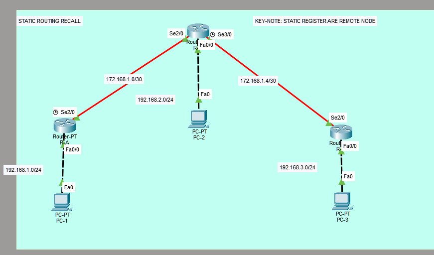

# Lab 01: Dasar Static Routing <Badge type="warning" text="WIP"/>

## 1. Concept High-Level <Badge type="warning" text="WIP>

> **TL;DR:** -.

- **Role:** -
- **Standard:** -
- **Why use it?** -

## 2. Lab Topology


| Device | Interface | IP Address | Role |
| :----- | :-------- | :-------------- | :--- |
| R-A | SE2/0 | 172.168.1.1 | Inter Router Link |
| R-A | FA0/0 | 192.168.1.1 | Acces Link |
| R-B | SE2/0 | 172.168.1.2 | Inter Router Link |
| R-B | SE2/0 | 172.168.1.5 | Inter Router Link |
| R-B | FA0/0 | 192.168.2.1 | Acces Link |
| R-C | SE2/0 | 172.168.1.6 | Inter Router Link |
| R-C | FA0/0 | 192.168.3.1 | Acces Link |

## 3. Configuration Guide

### Step 1: Base Config

Open a command prompt and type the following command:

```bash
PC-1>
C:\>ipconfig 192.168.1.1 255.255.255.0 192.168.1.1
PC-2>
C:\>ipconfig 192.168.2.1 255.255.255.0 192.168.2.1
etc... (Follow the same pattern with previous table topology)
```

::: details
`ipconfig`: Set the IP address, subnet mask, and default gateway for a network interface.
:::

### Step 2: Protocol Specifics

#### Step 2.1: Router Port Configuration

```bash
R-A>
R-A>en
R-A#conf t
Enter configuration commands, one per line.  End with CNTL/Z.
R-A(config)#interface Serial2/0
R-A(config-if)#ip address 172.168.1.1 255.255.255.252
R-A(config-if)exit
R-A(config)#interface Fa0/0
R-A(config-if)#ip address 192.168.1.1 255.255.255.0
etc... (Follow the same pattern with previous table topology)
```

::: tip
Configure for each ports.

Note: Use `no shutdown` for each ports after configured ip address, this will prevent the ports from shutting down.
:::

#### Step 2.2: Static Routing Configuration

```bash
R-A>
R-A>en
R-A#conf t
Enter configuration commands, one per line.  End with CNTL/Z.
R-A(config)#ip route 192.168.2.0 255.255.255.0 172.168.1.2
R-A(config)#ip route 192.168.3.0 255.255.255.0 172.168.1.2
etc... (Follow the same pattern with previous table topology)
```

::: tip
Configure Static Routing.

Note: netid netmask gateway
:::

## 4. Verification & Troubleshooting

**Key Command:**

- **Network Test:** `PC1: ping 192.168.3.2`, `PC3 ping 192.168.12`
- **Check 1:** Are ping destination working?
- **Check 2:** Are ping default gateway working?

## 5. My Personal Notes (The Oktanetflow Touch)

- **Difficulty:** Easy
- **Mistakes I Made:** Static Routing is a simple configuration, but difficult to manage when nodes are added or removed.
- **Related Resources:**
  - [Static Routing](/guide/layer-3/static-routing)
- **Downloads:**
  <ButtonVue variant="secondary" as="a" class="no-underline!" href="./lab-static-route.pkt" download>
  lab-static-route.pkt(Full Config)
  </ButtonVue>
