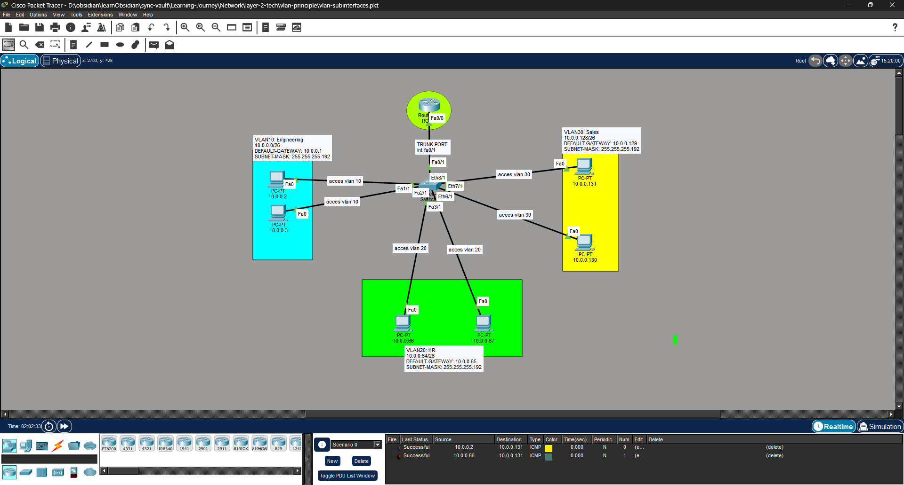

# Lab 02: Dasar VLAN ROAS(Router on a stick)

## 1. Concept High-Level

> **TL;DR:** ROAS provides a way Router to connect between VLANs using a single link to the core switch with sub-interfaces for each VLAN.

- **Role:** Layer 2 Data Forwarding
- **Standard:** IEEE 802.1Q
- **Why use it?** Broadcast Domain Segmentation, Logical Isolation, Enchanced Security and Performance

## 2. Lab Topology



##### SWITCH-1:

| Device   | Interface | IP Address | Role               | VLAN ID    |
| :------- | :-------- | :--------- | :----------------- | :--------- |
| Switch-1 | fa0/1     | -          | Core Switch(Trunk) | [10,20,30] |
| PC-1     | fa1/1     | 10.0.0.2   | Access             | 10         |
| PC-2     | fa2/1     | 10.0.0.3   | Access             | 10         |
| PC-3     | fa3/1     | 10.0.0.66  | Access             | 20         |
| PC-4     | eth6/1    | 10.0.0.67  | Access             | 20         |
| PC-5     | eth8/1    | 10.0.0.131 | Access             | 30         |
| PC-6     | eth7/1    | 10.0.0.130 | Access             | 30         |

::: info
`CIDR:` /26 

`DEFAULT GATEWAY VLAN 10 Engineering:` 10.0.0.1

`DEFAULT GATEWAY VLAN 20 HR:` 10.0.0.65

`DEFAULT GATEWAY VLAN 30 Sales:` 10.0.0.129

`SUBNET MASK`: .192 = 256 - 64 = 192
:::

## 3. Configuration Guide

### Step 1: Base Config

Open a command prompt and type the following command:

```bash
PC-1>
C:\>ipconfig 10.0.0.2 255.255.255.192 10.0.0.1
PC-2>
C:\>ipconfig 10.0.0.2 255.255.255.192 10.0.0.1
etc... (Follow the same pattern with previous table topology)
```

::: details
`ipconfig`: Set the IP address, subnet mask, and default gateway for a network interface.
:::

### Step 2: Protocol Specifics

#### Step 2.1: VLAN Creation

```bash
Switch>
Switch>en
Switch#conf t
Enter configuration commands, one per line.  End with CNTL/Z.
Switch(config)#vlan 10
Switch(config-vlan)#name Engineering
Switch(config-vlan)#ex
Switch(config)#vlan 20
Switch(config-vlan)#name HR
Switch(config-vlan)#ex
Switch(config)#vlan 30
Switch(config-vlan)#name Sales
Switch(config-vlan)#ex
```

::: tip
Configure VLANs for each department and other switches.

Note: Use `hostname <hostname>` for each switch/device for better organization.
:::

#### Step 2.2: VLAN Assignment

```bash
Switch>
Switch>en
Switch#conf t
Enter configuration commands, one per line.  End with CNTL/Z.
Switch(config)#int fa1/1
Switch(config-if)#switchport access vlan 10
Switch(config-if)#ex
etc... (Follow the same pattern with previous table topology)
```

#### Step 2.3: VLAN Trunk Assignment

```bash
Switch>
Switch>en
Switch#conf t
Enter configuration commands, one per line.  End with CNTL/Z.
Switch(config)#int fa0/1
Switch(config-if)#switchport mode trunk
Switch(config-if)#switchport trunk allowed vlan 10,20,30
```

#### Step 2.4: Router Sub-Interfaces Configuration

```bash
Router>
Router>en
Router#conf t
Enter configuration commands, one per line.  End with CNTL/Z.
Router(config)#int fa0/0.10 # Sub-Interface for VLAN 10
Router(config-subif)#encapsulation dot1Q 10 # VLAN ID
Router(config-subif)#ip address 10.0.0.1 255.255.255.192
Router(config-subif)#exit
etc... (Follow the same pattern for previous table topology)
```

## 4. Verification & Troubleshooting

**Key Command:**

- **Network Test:**
  - `ping <ip-address>`, should be able to reach each other(same VLAN-ID).
  - `ping <ip-address>`, should not be able to reach each other(different VLAN-ID).
- **VLAN Port Check:**

```bash
Switch(config)#do show vlan brief

VLAN Name                             Status    Ports
---- -------------------------------- --------- -------------------------------
1    default                          active    Fa4/1, Fa5/1, Eth9/1
10   Engineering                      active    Fa1/1, Fa2/1
20   HR                               active    Fa3/1, Eth6/1
30   Sales                            active    Eth7/1, Eth8/1
1002 fddi-default                     active    
1003 token-ring-default               active    
1004 fddinet-default                  active    
1005 trnet-default                    active    
```
- **Router Sub-Interfaces Check:**
```bash
Router(config)#do sh ip int brief

-------------------------------------------------------------------------------
Interface              IP-Address      OK? Method Status                Protocol 
FastEthernet0/0        unassigned      YES manual up                    up 
FastEthernet0/0.10     10.0.0.1        YES manual up                    up 
FastEthernet0/0.20     10.0.0.65       YES manual up                    up 
FastEthernet0/0.30     10.0.0.129      YES manual up                    up 
FastEthernet1/0        unassigned      YES unset  administratively down down 
Serial2/0              unassigned      YES unset  administratively down down 
Serial3/0              unassigned      YES unset  administratively down down 
FastEthernet4/0        unassigned      YES unset  administratively down down 
FastEthernet5/0        unassigned      YES unset  administratively down down
```

- **Check 1:** Are Network tests successful?
- **Check 2:** Are VLAN ports showing, and correct ports assigned?
- **Check 3:** Are Router Sub-Interfaces showing, and status is up?

## 5. My Personal Notes (The Oktanetflow Touch)

- **Difficulty:** Easy
- **Mistakes I Made:** The configuration is simple, but it can be leading to trouble. Make sure the default gateway is exactly the same as VLAN ID.
- **Related Resources:**
  - [VLANs Concepts](/guide/layer-2/vlans)
- **Downloads:**

  <ButtonVue variant="secondary" as="a" class="no-underline!" href="./lab-vlan-roas-assets/lab-vlan-dasar-roas.pkt" download>
  lab-vlan-dasar-roas.pkt(Full Config)
  </ButtonVue>
