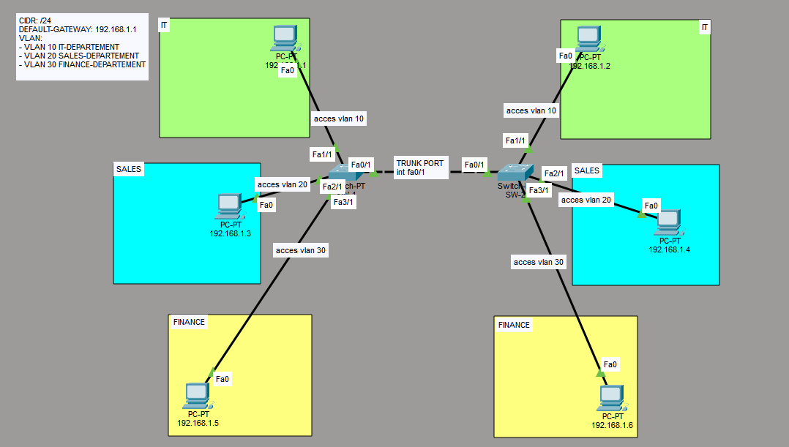

---
head:
  - - meta
    - name: description
      content: "Panduan lengkap Lab 01 Dasar VLAN & Trunking menggunakan Cisco Packet Tracer. Pelajari segmentasi broadcast domain, konfigurasi akses port, dan trunking."
  - - meta
    - name: keywords
      content: "Cisco Packet Tracer, Tutorial VLAN, Konfigurasi Trunking, Jaringan Komputer, Cisco Lab Indonesia, Switch Port Access, IEEE 802.1Q, Oktanetflow"
  - - meta
    - name: author
      content: "Oktanetflow"
  # Open Graph (Facebook, LinkedIn, Discord)
  - - meta
    - property: "og:title"
      content: "Lab 01: Dasar VLAN & Trunking - Oktanetflow"
  - - meta
    - property: "og:description"
      content: "Tutorial praktis konfigurasi VLAN dan Trunking di Cisco Packet Tracer untuk pemula."
  - - meta
    - property: "og:type"
      content: "article"
  - - meta
    - property: "og:image"
      content: "https://oktanetflow.vercel.app/ecosystem/cisco/labs/vlan/lab-vlan-dasar-trunking-topology.png" # Ganti dengan URL absolut gambar topologi
  # Twitter Card
  - - meta
    - name: "twitter:card"
      content: "summary_large_image"
  - - meta
    - name: "twitter:title"
      content: "Belajar Dasar VLAN & Trunking Cisco"
  - - link
    - rel: canonical
      href: "https://oktanetflow.vercel.app/ecosystem/cisco/labs/vlan/lab-vlan-dasar-trunking"
---

# Lab 01: Dasar VLAN & Trunking

## 1. Concept High-Level

> **TL;DR:** VLANs provide a way to segment the network into logical groups of devices.

- **Role:** Layer 2 Data Forwarding
- **Standard:**  IEEE 802.1Q
- **Why use it?** Broadcast Domain Segmentation, Logical Isolation, Enchanced Security and Performance

## 2. Lab Topology



##### SWITCH-1:

| Device   | Interface    | IP Address  | Role        | VLAN ID    |
| :------- | :----------- | :---------- | :---------- | :--------- |
| Switch-1 | fa0/1, fa3/1 | -           | Core Switch | [10,20,30] |
| PC-1     | fa1/1        | 192.168.1.1 | Access      | 10         |
| PC-2     | fa2/1        | 192.168.1.3 | Access      | 20         |
| PC-3     | fa3/1        | 192.168.1.5 | Access      | 30         |

##### SWITCH-2:

| Device   | Interface    | IP Address  | Role        | VLAN ID    |
| :------- | :----------- | :---------- | :---------- | :--------- |
| Switch-1 | fa0/1, fa3/1 | -           | Core Switch | [10,20,30] |
| PC-1     | fa1/1        | 192.168.1.2 | Access      | 10         |
| PC-2     | fa2/1        | 192.168.1.4 | Access      | 20         |
| PC-3     | fa3/1        | 192.168.1.6 | Access      | 30         |

::: info
`CIDR:` /24 as default

`DEFAULT GATEWAY:` 192.168.1.1
:::


## 3. Configuration Guide

### Step 1: Base Config

Open a command prompt and type the following command:

```bash
PC-1>
C:\>ipconfig 192.168.1.1 255.255.255.0 192.168.1.1
PC-2>
C:\>ipconfig 192.168.1.2 255.255.255.0 192.168.1.1
etc... (Follow the same pattern with previous table topology)
```

::: details
`ipconfig`: Set the IP address, subnet mask, and default gateway for a network interface.
:::

### Step 2: Protocol Specifics

#### Step 2.1: VLAN Creation
```bash
Switch>
Switch>en
Switch#conf t
Enter configuration commands, one per line.  End with CNTL/Z.
Switch(config)#vlan 10
Switch(config-vlan)#name IT-DEPARTMENT
Switch(config-vlan)#ex
Switch(config)#vlan 20
Switch(config-vlan)#name SALES-DEPARTMENT
Switch(config-vlan)#ex
Switch(config)#vlan 30
Switch(config-vlan)#name FINANCE-DEPARTMENT
Switch(config-vlan)#ex
```
::: tip
Configure VLANs for each department and other switches.

Note: Use `hostname <hostname>` for each switch/device for better organization.
:::

#### Step 2.2: VLAN Assignment
```bash
Switch>
Switch>en
Switch#conf t
Enter configuration commands, one per line.  End with CNTL/Z.
Switch(config)#int fa1/1   
Switch(config-if)#switchport access vlan 10
Switch(config-if)#ex
etc... (Follow the same pattern with previous table topology)
```

#### Step 2.3: VLAN Trunk Assignment
```bash
Switch>
Switch>en
Switch#conf t
Enter configuration commands, one per line.  End with CNTL/Z.
Switch(config)#int fa0/1   
Switch(config-if)#switchport mode trunk
Switch(config-if)#switchport trunk allowed vlan 10,20,30
etc... (Follow the same pattern for switch-2)
```

## 4. Verification & Troubleshooting

**Key Command:**

- **Network Test:** 
  - `ping <ip-address>`, should be able to reach each other(same VLAN-ID). 
  - `ping <ip-address>`, should not be able to reach each other(different VLAN-ID).
- **VLAN Port Check:**

```bash
Switch(config)#do show vlan brief

VLAN Name                             Status    Ports
---- -------------------------------- --------- -------------------------------
1    default                          active    Fa4/1, Fa5/1
10   IT-DEPARTEMENT                   active    Fa1/1
20   SALES-DEPARTEMENT                active    Fa2/1
29   VLAN0029                         active    
30   FINANCE-DEPARTEMENT              active    Fa3/1
1002 fddi-default                     active    
1003 token-ring-default               active    
1004 fddinet-default                  active    
1005 trnet-default                    active   
```

- **Check 1:** Are Network tests successful?
- **Check 2:** Are VLAN ports showing, and correct ports assigned?

## 5. My Personal Notes (The Oktanetflow Touch)

- **Difficulty:** Easy
- **Mistakes I Made:** Vlans setup can be confusing, make sure to configure Trunking first before assigning access ports and other switches doesn't need to be configured VLAN-ID if not needed.
- **Related Resources:**
  - [VLANs Concepts](/guide/layer-2/vlans)
- **Downloads:**

  <ButtonVue variant="secondary" as="a" class="no-underline!" href="./lab-vlan-dasar-trunking.pkt" download>
  lab-vlan-dasar-trunking.pkt(Full Config)
  </ButtonVue>
