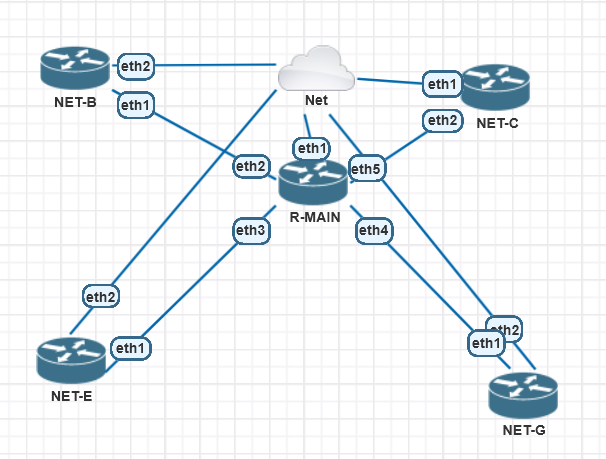

# Lab 01: Mikrotik Dasar Capstone(OSPF, NAT, DNS) via Winbox 4.0<Badge type="warning" text="wip" />

## 1. Concept High-Level

> **TL;DR:** Mikrotik RouterOS with OSPF, NAT, DNS, Simple Queue.

- **Role:** Layer 3 Routing Protocol
- **Standard:** OSPF
- **Why use it?** For Layer 3 Routing Protocol, OSPF is the best choice for single AS(Autonomous System).

## 2. Lab Topology



::: warning
This topology is for **Mikrotik RouterOS** may not be effective, but it's to force MAC address are appear at Winbox.
:::

##### R-MAIN:

| Device | Interface | IP Address         | Role                  |
| :----- | :-------- | :----------------- | :-------------------- |
| R-MAIN | eth1-eth5 | 192.168.197.141/24 | Backbone-Core         |
|        | eth2      | 172.16.1.1/30      | OSPF Bridge Interface |
|        | eth3      | 172.16.2.1/30      | OSPF Bridge Interface |
|        | eth4      | 172.16.3.1/30      | OSPF Bridge Interface |
|        | eth5      | 172.16.4.1/30      | OSPF Bridge Interface |

##### NET-B:

| Device | Interface | IP Address    | Role   |
| :----- | :-------- | :------------ | :----- |
| NET-B  | eth1      | 172.16.1.2/30 | AREA 0 |

##### NET-C:

| Device | Interface | IP Address    | Role   |
| :----- | :-------- | :------------ | :----- |
| NET-C  | eth2      | 172.16.4.2/30 | AREA 0 |

##### NET-E:

| Device | Interface | IP Address    | Role   |
| :----- | :-------- | :------------ | :----- |
| NET-E  | eth1      | 172.16.2.2/30 | AREA 0 |

##### NET-G:

| Device | Interface | IP Address    | Role   |
| :----- | :-------- | :------------ | :----- |
| NET-G  | eth1      | 172.16.3.2/30 | AREA 0 |

::: info
NOTE: OSPF Use to configure.
Example: `/24 255.255.255.0  will be stand for 0.0.0.255`
:::

## 3. Configuration Guide

### Step 1: Base Config

Open a winbox and type the following command:

```bash
System>Identity>Identity><R-MAIN>
etc... (Follow the same with previous table topology Router Hostname)
```

::: details
`CLI>`: /System identity set name=R-MAIN;
:::

### Step 2: Protocol Specifics

#### Step 2.1: R-MAIN Firewall NAT & DNS Configuration Via Winbox

```bash
IP>FIREWALL>NAT

CHAIN=srcnat
ACTION=masquerade
OUT-INTERFACE=eth1

IP>DNS>SETTINGS
SERVERS=8.8.8.8
ALLOW-REMOTE-REQUESTS=yes
```

#### Step 2.2: IP Interface Configuration

```bash
IP>ADDRESSES>ADDRESS 
R-MAIN eth2 172.16.1.1/30
R-MAIN eth3 172.16.2.1/30
R-MAIN eth4 172.16.3.1/30
R-MAIN eth5 172.16.4.1/30

NET-B eth1 172.16.1.2/30
etc... (Follow the same pattern for previous table topology)
```

#### Step 2.3: OSPF Configuration

```bash
R-MAIN
/routing ospf instance add name=default-v2 version=2 originate-default=if-installed
/routing ospf area add instance=default-v2 name=backbone area-id=0.0.0.0
/routing ospf interface-template add area=backbone interfaces=eth2
etc... (Follow the same pattern for previous table topology from eth2 until eth5)

NET-B
/routing ospf instance add name=default-v2 version=2 
/routing ospf area add instance=default-v2 name=backbone area-id=0.0.0.0
/routing ospf interface-template add area=backbone interfaces=eth1
etc... (Follow the same pattern for previous table topology from eth1)
```

## 4. Verification & Troubleshooting

**Key Command:**

- **Network Test:**
  - `Routing > OSPF > Neighbor` status **Full**
  - `ping 8.8.8.8` (Google DNS Server) each device router
  - `ping 172.16.1.2` (NET-B) from R-MAIN and each device router

- **Check 1:** OSPF status is **Full**
- **Check 2:** Are all devices able to ping Google DNS Server?
- **Check 3:** Are all devices able to ping each other?

## 5. My Personal Notes (The Oktanetflow Touch)

- **Difficulty:** Easy
- **Mistakes I Made:** The configuration is simple, but difficult to implement with pnet because can't open HTML Console to activate Romon.
- **Related Resources:**
- **Downloads:**