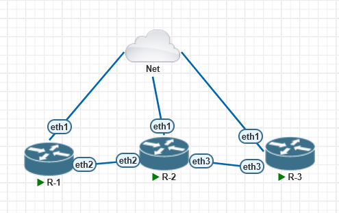

# Lab 01: Dasar Static Routing <Badge type="warning" text="WIP"/>

## 1. Concept High-Level

> **TL;DR:** -.

- **Role:** -
- **Standard:** -
- **Why use it?** -

## 2. Lab Topology



| Device | Interface | IP Address      | Role |
| :----- | :-------- | :-------------- | :--- |
| R-1    | ETH1      | 192.168.197.147 | NAT  |
| R-2    | ETH1      | 192.168.197.146 | NAT  |
| R-3    | ETH1      | 192.168.197.145 | NAT  |

## 3. Configuration Guide

### Step 1: Base Config

Open a command prompt and type the following command:

```bash
/ip route add dst-address=0.0.0.0/30 gateway=192.168.197.2
```

::: info
NOTE: Since in pnetlab our used same subnet, we need the static route has been configured by use the universe destination address 0.0.0.0 with same gateway.
if you want to use different subnet, you need to change the static route to the gateway of your subnet with /30.
:::

## 4. Verification & Troubleshooting

**Key Command:**

- **Network Test:** `R1: ping 192.168.197.145`, `R1: ping 192.168.197.2`
- **Mac Address Check:**

- **Check 1:** Are ping destination working?
- **Check 2:** Are ping default gateway working?

## 5. My Personal Notes (The Oktanetflow Touch)

- **Difficulty:** Easy
- **Mistakes I Made:** Mikrotik offer winbox, that's made configuration easier.
- **Related Resources:**
  - [Static Routing](/guide/layer-3/static-routing)
- **Downloads:**
  <ButtonVue variant="secondary" as="a" class="no-underline!" href="./STATIC_ROUTE.unl" download>
  lab-static-route.unl(Full Config)
  </ButtonVue>
