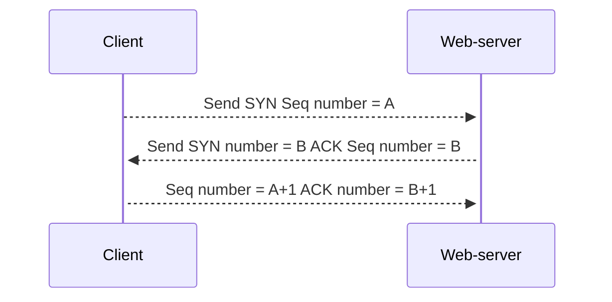
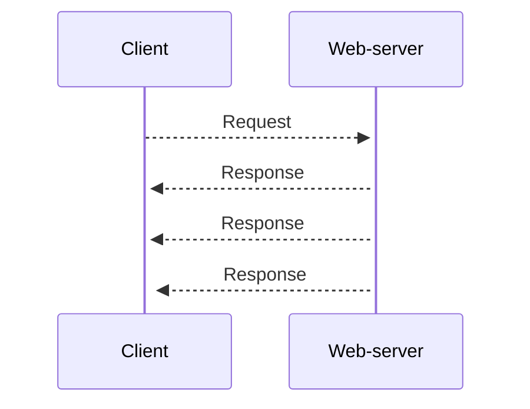

# TCP/UDP Essentials <Badge type="tip" text="beta" />

## TCP

### 1. Konsep & Analogi
::: info Definisi Singkat
TCP adalah protokol transport yang menjamin data sampai dengan urut dan selamat (reliable).
:::

* **Analogi:** Bayangkan percakapan telepon. "Halo, dengar saya?" -> "Ya, saya dengar." -> "Oke, saya mulai bicara."
* **Karakteristik Utama:**
    * Connection-oriented (Harus kenalan dulu).
    * Reliable (Ada garansi sampai).
    * Flow Control (Tidak membanjiri penerima).

### 2. Anatomi Header

*Fokus pada bagian penting:*
1.  **Sequence Number (32 bit):** Nomor urut paket (agar bisa disusun ulang).
2.  **Acknowledgment (32 bit):** Tanda terima ("Paket nomor 10 sudah sampai!").
3.  **Control Flags (1 bit each):** Lampu indikator status (SYN, ACK, FIN, RST).

### 3. Mekanisme Kerja (Mermaid Diagram)
Bagaimana TCP memulai koneksi (3-Way Handshake)?

## UDP

### 1. Konsep & Analogi
::: info Definisi Singkat
UDP adalah protokol transport yang tidak menjamin data sampai.
:::

* **Analogi:** Bayangkan seperti mengisi air tanpa memperdulikan apakah air sudah meluap."
* **Karakteristik Utama:**
    * Connectionless (Tidak perlu kenalan).
    * Unreliable (Tidak ada garansi sampai).
    * No Flow Control (Tidak ada kontrol penerima).

### 2. Anatomi Header

::: info UDP Header
UDP hanya memiliki header 8 bytes.
:::

*Fokus pada bagian penting:*

1.  **Source Port (16 bit):** Nomor port sumber pengirim.
2.  **Destination Port (16 bit):** Nomor port tujuan penerima.

### 3. Mekanisme Kerja (Mermaid Diagram)
Bagaimana UDP mengirim dan menerima data?

