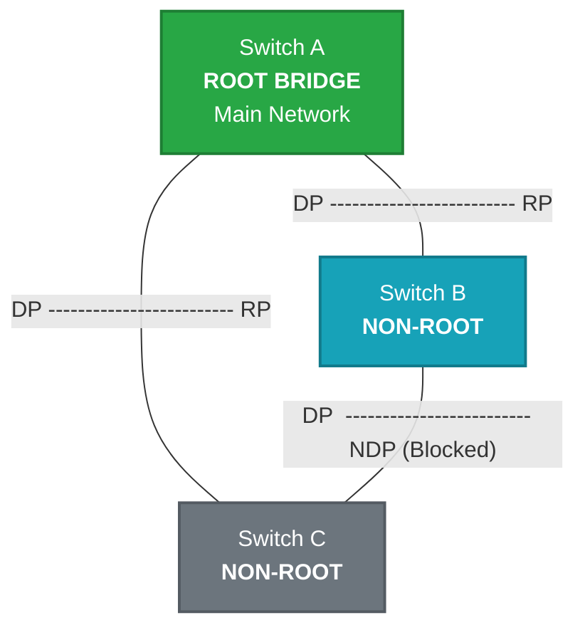

# Spanning Tree Concept <Badge type="tip" text="beta" />

## Spanning Tree Protocol

### 1. Konsep & Analogi
::: info Definisi Singkat
STP(Spanning Tree Protocol) adalah teknologi pada switch untuk mencegah loop dalam jaringan dengan mengatur prioritas antar perangkat.
:::

* **Analogi:** Polisi penjaga portal di jalan tol ganda.

Bayangkan ada dua jalan tol menuju kota yang sama. Tanpa aturan, mobil (data) bisa tersesat dan berputar-putar tanpa henti di kedua jalan tersebut sampai macet total (looping). STP adalah polisi yang menutup sementara jalan cadangan dengan portal. Jika jalan utama terputus, barulah portal di jalan cadangan dibuka. Jaringan tetap berjalan, kemacetan terhindari.

* **Karakteristik Utama:**
    * Loop Prevention (Mencegah looping jaringan antar switch). 
    * Root-Bridge Election (Switch memilih jalur terbaik berdasarkan BID).

::: info
BID(Bridge Identifier) = (Priority + VLAN number) : (System MAC address) 
:::

### 2. Anatomi Header Bridge Protocol Data Units (BPDUs)
*Fokus pada bagian penting:*
1.  **Root Bridge ID** : The BID of the current root bridge.
2.  **Root Path Cost:** The cost from the sending switch to the root bridge.
3.  **Sender Bridge ID:** The BID of the switch sending the BPDU.
4. **Sender Port ID:** The port ID from which the BPDU was sent.
5. **Timers:** Hello Time, Max Age, Forward Delay. These timers govern the STP process.
### 3. Mekanisme Kerja (Mermaid Diagram)
Bagaimana STP bekerja dalam switch?

### 4. Network Labs: Implementation & Hands-on

#### Cisco Mastery
* **Cisco**: [Lab 01: Dasar STP](../../ecosystem/cisco/labs/stp/lab-stp-dasar.md).

::: tip Multi Vendor Coming soons
More content coming soon! We are still focusing on Cisco Mastery. Check back later for updates.
