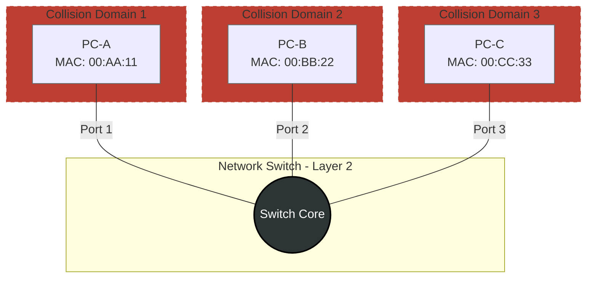

# Switch Concept <Badge type="tip" text="beta" />

## Switch

### 1. Konsep & Analogi
::: info Definisi Singkat
Switch adalah perangkat jaringan yang menghubungkan beberapa perangkat jaringan.
:::

* **Analogi:** Ibarat seorang kurir menggirimkan paket, berdasarkan data informasi yang unik dan ekslusif.
* **Karakteristik Utama:**
    * MAC Address Learning & Forwarding (Menyimpan alamat MAC dan mengirimkannya).
    * Collision Domain (Setiap port memiliki jalur yang ekslusif).
    * Sclable, Widely Used, Fast (Skalabel, sering digunakan, cepat).

### 2. Anatomi Header

*Fokus pada bagian penting:*
1.  **Destination Address (6 bytes):** Nomor MAC perangkat tujuan.
2.  **Source Address (6 bytes):** Nomor MAC perangkat sumber.
3.  **Preamble (7 bytes):** Untuk menandakan frame akan datang serta memberikan informasi kepada penerima.

### 3. Mekanisme Kerja (Mermaid Diagram)
Bagaimana topology switch menghubungkan perangkat jaringan?

### 4. Network Labs: Implementation & Hands-on

#### Cisco Mastery
* **Cisco**: [Lab 01: Dasar Switch](../../ecosystem/cisco/labs/switching/lab-switch-dasar.md).

::: tip Multi Vendor Coming soons
More content coming soon! We are still focusing on Cisco Mastery. Check back later for updates.
