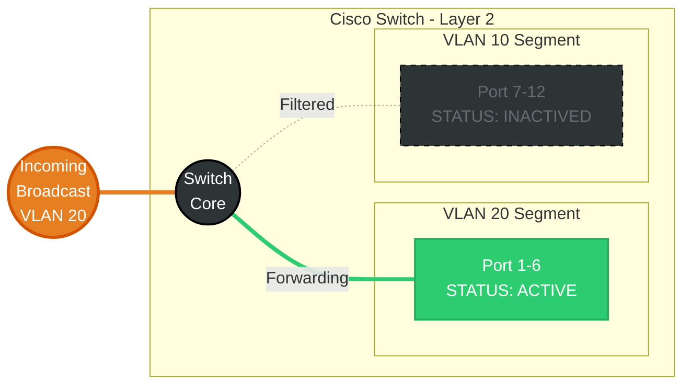

# VLANs Concept <Badge type="tip" text="beta" />

## VLANs

### 1. Konsep & Analogi
::: info Definisi Singkat
VLAN(Virtual Local Area Network) adalah teknologi pada switch yang memungkinkan isolasi jaringan dalam perangkat yang sama.
:::

* **Analogi:** Kantor tanpa ruang kerja tiap departemen.

    Bayangkan sebuah kantor tanpa ruang kerja tiap departemen. Apabila seseorang departemen A berdiskusi, maka seluruh departemen lain akan mendengar. Akan berbeda jika mereka berdiskusi di ruang kerja masing-masing`(VLAN)`.

* **Karakteristik Utama:**
    * Broadcast Domain Segmentation (Membuat unik broadcast domain). 
    * Logical Isolation (Pengguna dan device dikelompokkan dalam VLAN).
    * Enchanced Security and Performance (Meningkatkan keamanan dan performa, tanpa perlu menggirimkan broadcast traffic yang tidak diperlukan).

::: info
By default, Switch has single Broadcast Domain. With Frame flooding mechanism, will be broadcasted to all active ports.
:::

### 2. Anatomi Header IEEE 802.1Q VLAN Tagging

*Fokus pada bagian penting:*
1.  **Tag Protocol Identifier(TPID) (2 bytes):** Identifikasi 802.1Q tagged frame.
2.  **Tag Control Information(TCI) (2 bytes):** Identifikasi Informasi kontrol->(Priority,DEI(Drop Eligible Indicator), VID(VLAN ID)).

### 3. Mekanisme Kerja (Mermaid Diagram)
Bagaimana VLANs bekerja dalam switch?

### 4. Network Labs: Implementation & Hands-on

#### Cisco Mastery
* **Cisco**: [Lab 01: Dasar VLAN & Trunking](../../ecosystem/cisco/labs/vlan/lab-vlan-dasar.md).

::: tip Multi Vendor Coming soons
More content coming soon! We are still focusing on Cisco Mastery. Check back later for updates.
