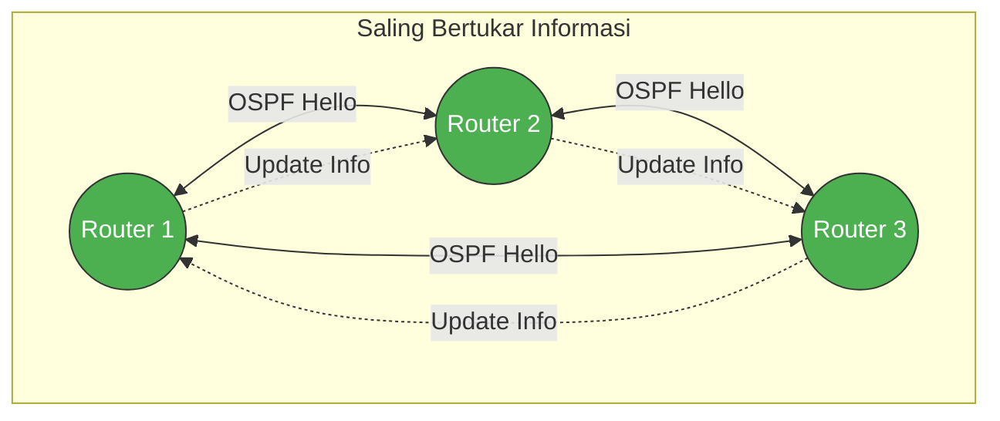

# Dynamic Routing <Badge type="tip" text="beta" />

## Dynamic Routing

### 1. Konsep & Analogi
::: info Definisi Singkat
Dynamic Routing adalah metode di mana router menentukan jalur pengiriman data secara otomatis dengan saling bertukar informasi rute antar-router. Menggunakan protokol khusus (seperti OSPF atau EIGRP), router dapat beradaptasi secara mandiri jika ada perubahan jalur atau kerusakan kabel di dalam jaringan.
:::

* **Analogi:** seperti menggunakan GPS; jika ada jalan yang ditutup, GPS otomatis mencarikan jalan pintas baru untuk Anda..
* **Karakteristik Utama:**
    * Scalability (Skalabel dengan jumlah perangkat).
    * Adaptability (Adaptif dengan kondisi route).
    
### 2. Anatomi Header

*Fokus pada bagian penting:*
1.  **Router ID:** ID Router unik
2.  **Metric/Cost:** Cost untuk menghitung jalur terpendek
3.  **Adjecency/Neighbor Table:** Daftar router tetangga yang dapat dihubungi oleh router

### 3. Mekanisme Kerja (Mermaid Diagram)
Bagaimana dynamic routing mengirim dan menerima data?

### 4. Network Labs: Implementation & Hands-on

::: tip Multi Vendor Coming soons
More content coming soon! We are still focusing on Cisco Mastery. Check back later for updates.
