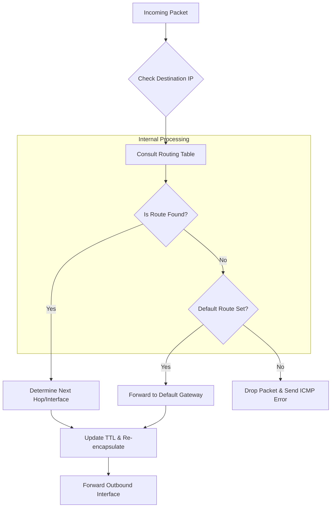

# Router Concept <Badge type="tip" text="beta" />

## Router

### 1. Konsep & Analogi
::: info Definisi Singkat
Router adalah perangkat jaringan yang mengatur lalu lintas jaringan.
:::

* **Analogi:** Ibarat lampu lalu lintas, router mengatur lalu lintas.
* **Karakteristik Utama:**
    * NAT (Network Address Translation).
    * Routing (Algoritma penentuan lalu lintas).
    * Bandwidth Management (Mengatur kecepatan lalu lintas).
    * Etc.
    
### 2. Anatomi Header

*Fokus pada bagian penting:*
IPv4
1.  **Destination Address (32 bit):** Tujuan IP.
2.  **Source Address (32 bit):** Sumber IP.

### 3. Mekanisme Kerja (Mermaid Diagram)
Bagaimana router mengatur lalu lintas jaringan?

### 4. Network Labs: Implementation & Hands-on

::: tip Multi Vendor Coming soons
More content coming soon! We are still focusing on Cisco Mastery. Check back later for updates.
