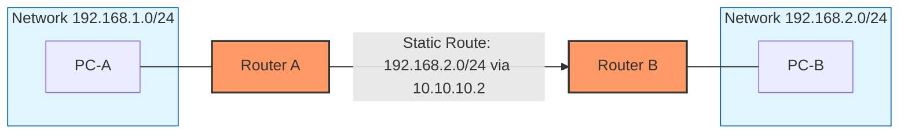

# Static Routing <Badge type="tip" text="beta" />

## Static Routing

### 1. Konsep & Analogi
::: info Definisi Singkat
Static routing adalah metode konfigurasi rute jaringan di mana administrator mengisi tabel routing secara manual. Router tidak akan mencari jalan sendiri; ia hanya akan mengirim data ke tujuan melalui jalur tetap yang sudah ditentukan sebelumnya oleh manusia.
:::

* **Analogi:** Bayangkan Anda adalah seorang kurir di sebuah perumahan baru yang belum ada di Google Maps. Seperti Anda diberi secarik kertas instruksi: "Pokoknya kalau mau ke Blok A, kamu harus lewat Jalan Melati. Titik".
* **Karakteristik Utama:**
    * Low Resource Utilization (Penggunaan sumber daya rendah).
    * Fixed Routing (Rute tetap yang sudah ditentukan sebelumnya).
    
### 2. Anatomi Header

*Fokus pada bagian penting:*
1.  **Network Address:** Network ID Destination
2.  **Mask:** Subnet Mask Destination
3.  **Next Hop:** Next Hop Address

### 3. Mekanisme Kerja (Mermaid Diagram)
Bagaimana static routing mengirim dan menerima data?

### 4. Network Labs: Implementation & Hands-on

::: tip Multi Vendor Coming soons
More content coming soon! We are still focusing on Cisco Mastery. Check back later for updates.
