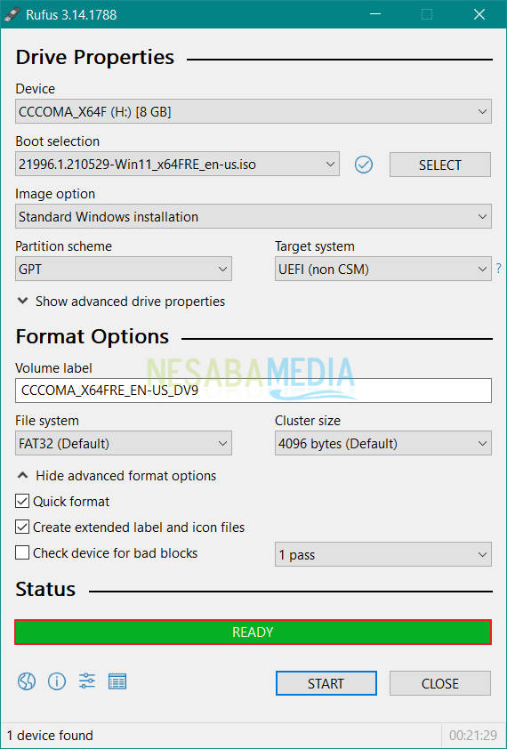
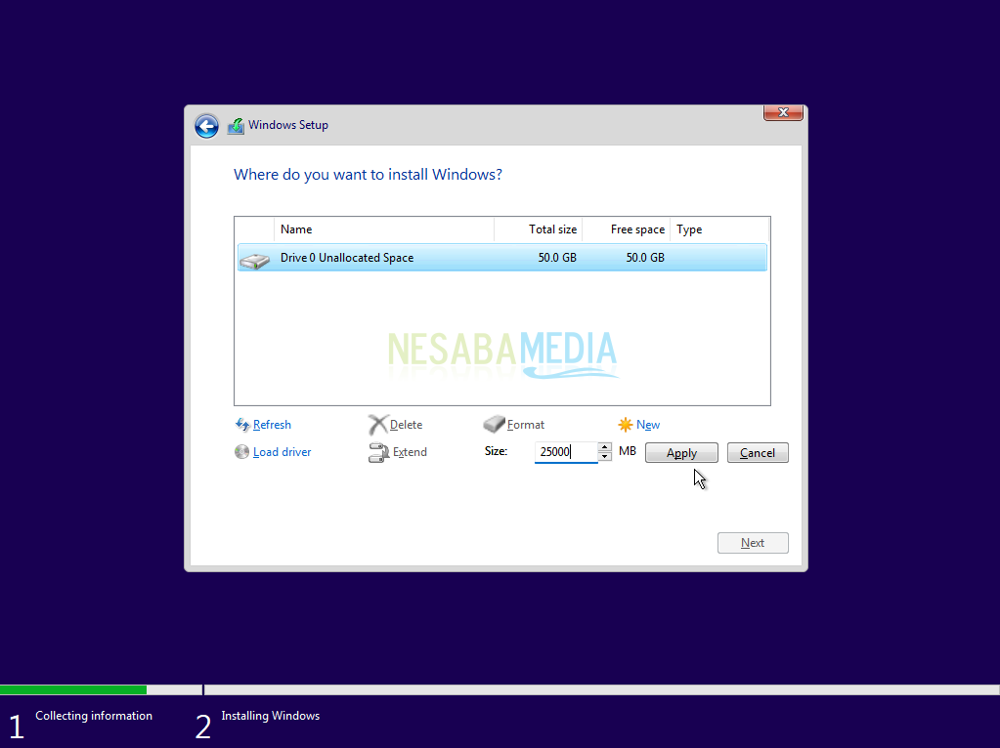

# Tools Guide: Bootable USB OS Installer

## 1. Prerequisites and Installation

### Step 1: Prerequisites

- Ensure you already have [Rufus](https://rufus.ie/id/) installed on your computer.
- Flasdisk must be supported for installation(USB Recommended 16GB+).

### Step 2: Installation

- Download [ISO File OS](https://www.nesabamedia.com/download-windows-11-iso/) The file must be `.iso` format.


#### Step 2.1: Bootable with Rufus

Ensure follow the specs information below:




## 3. Configuration into new device

### Step 3.1: Get the information about your device

- Ensure bootable USB OS installer has been connected with your device.
- Ensure your device is have SSD/HDD storage for partition.

### Step 3.2: Configuration BIOS

```bash 
press F2 key, and choose "BIOS Setup"   
boot>drive menu(make sure the bootable USB OS installer is the first bootable device)
```
::: info
Note: Some device may directly set bootable USB OS installer as the main.
:::

### Step 3.3: Partition



::: info
Note: Just select larger partition, and click apply and next-next.
:::

### Step 3.4: Windows Setup

::: info
Note: Just click next, and click install until the end.
After screen is closed, unplugged the bootable USB OS installer.
:::

## 4. Verification 

- **Check 1:** Are Windows able startup?
- **Check 2:** Are there any error message when install?