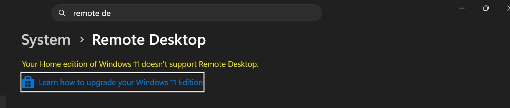
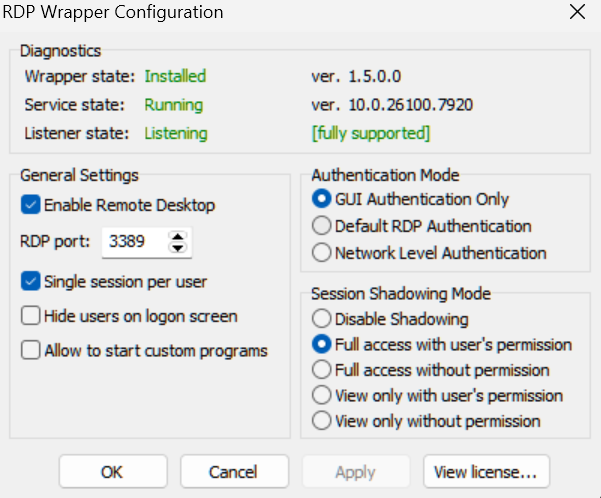

# Tools Guide: RDP Wrapper Configuration

## 1. Prerequisites and Installation

### Step 1: Prerequisites

- Ensure you device is unsupported RDP(Windows 10/11 Home edition).



::: info
Note: If your device is supported RDP, these guides may not for you.
:::

### Step 2: Installation

- Download [RDP Wrapper](https://github.com/stascorp/rdpwrap/releases/tag/v1.6.2)
- On Android, download [Windows APP](https://play.google.com/store/apps/details?id=com.microsoft.rdc.androidx&hl=id) for testing RDP
- Prepare the `.ini` config file from [sebaxakerhtc .ini config](https://github.com/sebaxakerhtc/rdpwrap.ini/blob/master/rdpwrap.ini)

::: info
Note: Windows Defender Firewall (Windows Firewall) maybe triggered, you can ignore this or allow this app to run on Windows.
:::

#### Step 2.1: Download RDP Wrapper after extracting
```bash 
install.bat

via cmd as administrator run this command:

cd C:\Program Files\RDP Wrapper

C:\Program Files\RDP Wrapper>notepad rdwrap.ini (change the content with Step 2)

restart your device.
```

#### Step 2.2: Verify RDP Wrapper 
after previous step configured, the RDPConf should be like this:




## 3. Testing Guide 

### Step 1: Get the information about your device

```bash 
In Network and Internet Settings, click on "Network & Internet" and then click on "Advanced" and then click on "Network Connections" to view the network information.

Get the IPv4 address
```

### Step 2: Windows App Android

```bash 
Devices>Add>PC Connections

PC NAME: <IPV4 your device>
```

## 4. Verification 

- **Check 1:** Are Windows App able to connect?
- **Check 2:** Are Conf status is **Full** Running and state is Connected?
